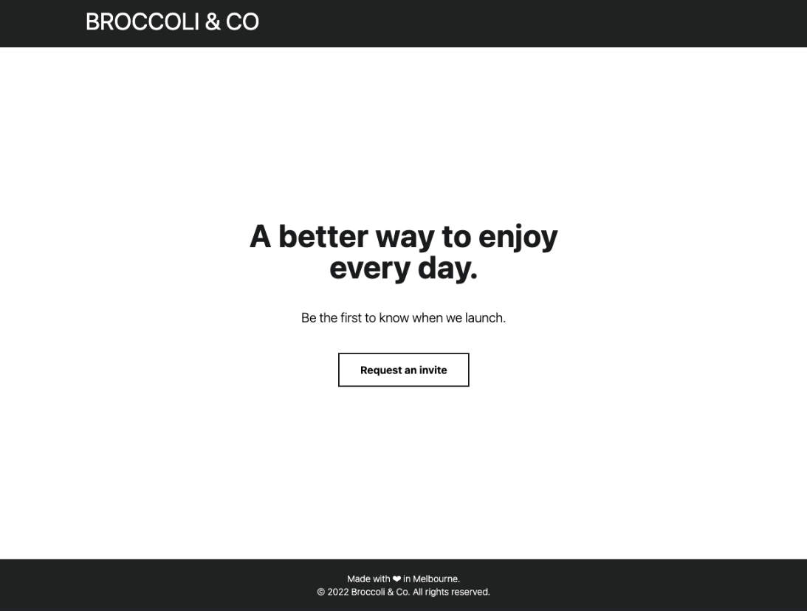

# Broccoli & Co App

## What skills I use

• TypeScript

• Tailwind CSS

• React

• Next.js 13 

• axios

• @next/font

• React Icon

• jest

# Front-end Style Guide

## Colors

### Primary

- Desaturated Dark Cyan: hsl(180, 29%, 50%)

### Neutral

- Dark : #1B1C1D
- Gray: #232424
- button: #D55F52
- hover: #DB7B71
- error: #D55F52

## Typography

- Family: [Roboto](https://fonts.google.com/specimen/Roboto)
- Weights: 300, 400, 700

## How to Start a project

1. Install node_modules

   `yarn` 

2. Type command and implement package.json

   `yarn run dev` 

## Start Server

[http://localhost:3000](http://localhost:3000) to view it in the browser.

## What do I learn from this project?

• [Upgrade-Guide](https://beta.nextjs.org/docs/upgrade-guide)

• [Disable form validation in browser](https://stackoverflow.com/questions/9399528/disable-form-validation-in-browser)

### Demo

You can see [Broccoli & Co App](https://broccoli-co.vercel.app)

### What I am planning to do 

1. Custom Hook - Repetition of different states is an issue. I should learn how to make a custom-hook for a variety of input

2. Cypress - End to End testing is important and make sure UX is running fine. Ex" users log in 
